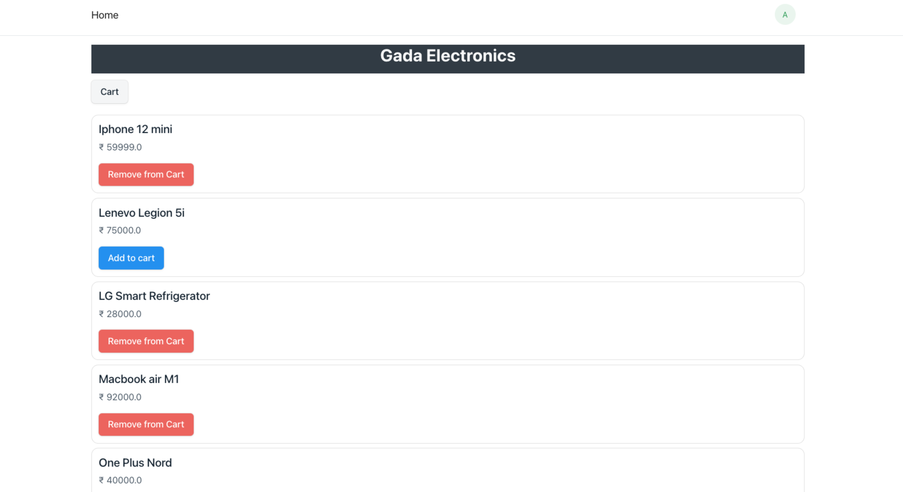
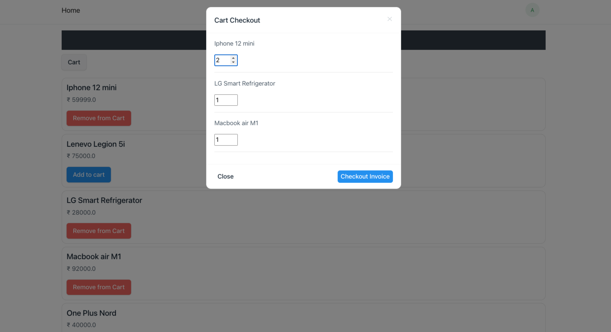

## Accounting

An simple accounting application built with frappe framework. This app was built to get myself familiar with the frappe framework.

#### Features
* Generating Sales and Purchase Invoice.
* Making a Payments against an Invoice.
* Tree view for chart of accounts.
* Balance sheet and Profit and Loss reports.
* Web store to add items to cart and generate an Invoice.

#### Install instructions

```bash
bench get-app https://github.com/rutwikhdev/accounting.git

bench --site site_name install-app accounting
```

#### Web flow





#### License

MIT
